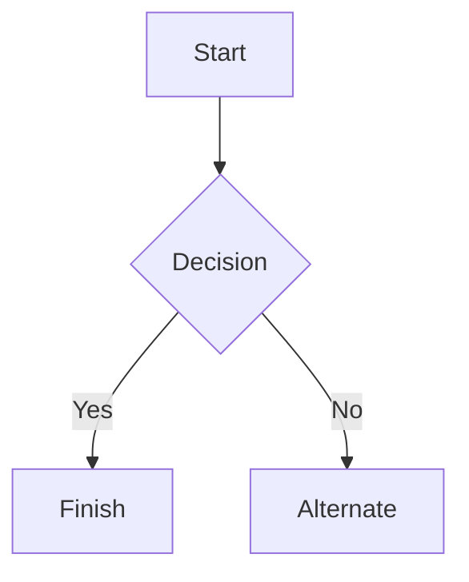

# Instalasi dan Konfigurasi DNS Server Menggunakan PowerDNS pada Ubuntu 24.04 LTS

Pelajari cara instalasi dan konfigurasi DNS Server menggunakan BIND di Kilat VM 2.0 berbasis Ubuntu 18.04. Panduan lengkap mulai dari persiapan, setup Glue Record, hingga konfigurasi zona domain.
***

Halo, Kawan Belajar!

DNS atau Domain Name System merupakan sistem yang digunakan untuk menerjemahkan nama domain menjadi IP Address. Dengan adanya DNS, pengguna dapat mengakses layanan menggunakan nama domain tanpa harus mengingat IP Address dari server.

Salah satu aplikasi yang dapat digunakan sebagai DNS Server adalah **PowerDNS**. PowerDNS merupakan DNS Server yang digunakan untuk menangani permintaan DNS dan mengelola informasi domain melalui DNS Zone dan DNS Record.

Pada panduan kali ini, akan dilakukan instalasi dan konfigurasi **PowerDNS pada Kilat VM 2.0** dengan sistem operasi Ubuntu. Konfigurasi dilakukan menggunakan domain sendiri dengan nameserver ns1 dan ns2 sehingga diperlukan Glue Record.

# 1. Pengenalan


**PowerDNS** adalah perangkat lunak DNS Server yang digunakan untuk mengelola dan melayani permintaan DNS pada sebuah domain. PowerDNS bertugas menerjemahkan nama domain menjadi informasi yang dibutuhkan, seperti alamat IP, sehingga domain dapat diakses oleh pengguna.

**Cara kerja PowerDNS** secara sederhana adalah ketika pengguna mengakses suatu domain, permintaan DNS akan diteruskan ke **Nameserver** yang menggunakan PowerDNS. PowerDNS kemudian mencari informasi domain pada **DNS Zone** dan **DNS Record** yang telah dikonfigurasi, lalu mengembalikan hasilnya kepada pengguna.

**Fungsi PowerDNS** antara lain:
* Menjadi DNS Server untuk sebuah domain.
* Mengelola DNS Zone dan DNS Record.
* Menjawab permintaan DNS dari client.
* Mendukung berbagai jenis DNS Record seperti A, AAAA, CNAME, MX, NS, dan TXT.
* Dapat menggunakan database sebagai tempat penyimpanan data DNS, tergantung backend yang digunakan.

# 2. Persiapan

Untuk melakukan instalasi dan konfigurasi DNS Server menggunakan PowerDNS, beberapa kebutuhan yang perlu disiapkan antara lain:
* Domain dan Kilat VM 2.0 aktif.
* Sistem operasi Ubuntu 24.04.
* Setup Glue Record.

Jika belum memiliki Kilat VM 2.0, pengguna dapat melakukan pemesanan layanan Kilat VM 2.0 melalui CloudKilat.
# 3. Instalasi dan Konfigurasi
### a. Setup Glue Record
Sebelum melakukan konfigurasi PowerDNS, pastikan domain telah memiliki **Glue Record** apabila menggunakan nameserver sendiri.

Glue Record merupakan informasi IP Address yang digunakan oleh suatu nameserver dan didaftarkan pada registrar domain.


Adapun panduan cara setup Glue Record seperti berikut ini:

1. [Login Portal Client Area CloudKilat](https://portal.cloudkilat.com/clientarea) terlebih dahulu.
2. Untuk langkah-langkah lengkapnya, Anda dapat mengikuti panduan resmi melalui tautan [Cara Menggunakan Private Name Server pada Domain di Portal Client CloudKilat](https://kb.cloudkilat.id/domain-di-cloudkilat/cara-menggunakan-private-name-server-pada-domain-di-portal-client-cloudkilat).
### b. Install dan Konfigurasi PowerDNS
Selanjutya, untuk melakukan instalasi dan konfigurasi DNS Server, silakan mengikuti langkah-langkah berikut ini:

Masuk ke Kilat VM 2.0 Anda terlebih dahulu, atau Anda juga bisa melakukan *remote* menggunakan SSH. Jika Anda masih belum mengetahui cara *remote* menggunakan SSH, silakan membaca panduannya melalui tautan [Cara Akses Kilat VM Melalui SSH](https://kb.cloudkilat.id/akses-kilat-vm/cara-akses-kilat-vm-melalui-ssh).

Setelah berhasil masuk ke dalam Kilat VM 2.0, perbarui paket sistem ke versi terbaru dengan menjalankan perintah berikut seperti pada Gambar 1:

```
apt update -y
```

<p align="center">
  
  <br>
  <em>Gambar 1: Update Paket Ubuntu Server</em>
</p>

Tunggu proses update hingga benar-benar selesai, dan selanjutnya install paket PowerDNS menggunakan perintah : 

```
apt install pdns-server
```

tekan **Y** apabila diminta untuk melanjutkan proses instalasi seperti pada Gambar 2:
<p align="center">
  
  <br>
  <em>Gambar 2: Instalasi PowerDNS</em>
</p>

Setelah proses instalasi selesai, Anda dapat memeriksa versi PowerDNS yang terinstal menggunakan perintah sebagai berikut:

```
pdns_server --version
```
<p align="center">
  
  <br>
  <em>Gambar 3: Versi PowerDNS</em>
</p>

Kemudian, aktifkan dan pastikan service PowerDNS berjalan dengan baik menggunakan perintah status berikut, dan pastikan statusnya bernilai active (running):

```
systemctl status pdns
```
PowerDNS dapat menggunakan berbagai jenis *backend* untuk menyimpan data DNS. Pada praktik ini, digunakan MariaDB sebagai *database backend*.

Instal MariaDB dengan menjalankan perintah berikut:
```
apt install mariadb-server
```
tekan **Y** apabila diminta untuk melanjutkan proses instalasi seperti pada Gambar 4:

Setelah instalasi selesai, cek service MariaDB untuk memastikan berjalan dengan normal:
```
systemctl status mariadb
```

Selanjutnya, install backend MariaDB untuk PowerDNS menggunakan perintah berikut:
# 4. Verifikasi
### This is a Heading h2
###### This is a Heading h6

## Emphasis

*This text will be italic*  
_This will also be italic_

**This text will be bold**  
__This will also be bold__

_You **can** combine them_

## Lists

### Unordered

* Item 1
* Item 2
* Item 2a
* Item 2b
    * Item 3a
    * Item 3b

### Ordered

1. Item 1
2. Item 2
3. Item 3
    1. Item 3a
    2. Item 3b

## Images


## Links

You may be using [Markdown Live Preview](https://markdownlivepreview.com/).

## Blockquotes

> Markdown is a lightweight markup language with plain-text-formatting syntax, created in 2004 by John Gruber with Aaron Swartz.
>
>> Markdown is often used to format readme files, for writing messages in online discussion forums, and to create rich text using a plain text editor.

## Tables

| Left columns  | Right columns |
| ------------- |:-------------:|
| left foo      | right foo     |
| left bar      | right bar     |
| left baz      | right baz     |

## Blocks of code

```
let message = 'Hello world';
alert(message);
```

## Mermaid diagrams


## Inline code

This web site is using `markedjs/marked`.


